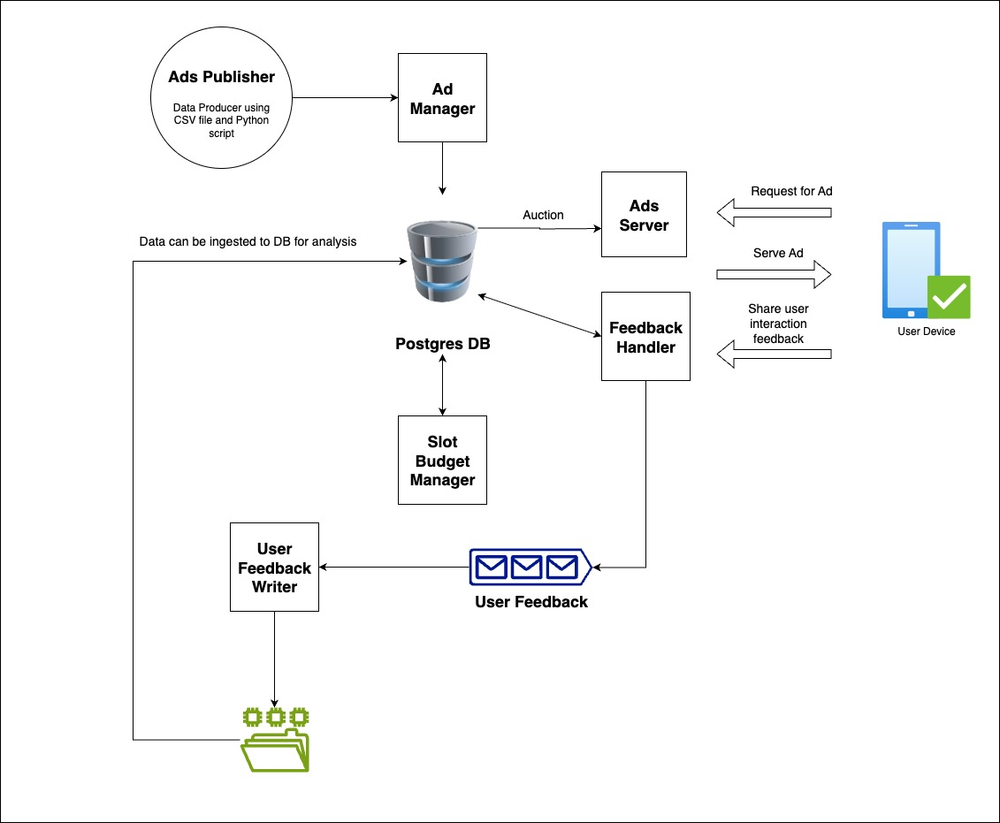

# DE Project: Online Advertisement Platform

This project outlines the architecture and implementation of a data-intensive online advertising platform. It is designed to handle advertising campaigns, serve ads to users, track user feedback, and generate reports. The system simulates the entire lifecycle of an ad campaign, from creation and management to serving ads, running auctions, and handling user feedback for analytics. It is built using a microservices-oriented architecture with modern data engineering tools to create a robust and scalable pipeline.

-----

## ETL Architecture

The diagram below illustrates the architecture for our Ads Campaign ETL (Extract, Transform, Load) pipeline.


-----

## Architecture Overview

The platform follows a distributed, event-driven architecture, mirroring a real-world advertising system.

  * **Ad Data Producer**: A Python script `kafka_ads_data_producer.py` that reads ad campaign data from a CSV `kafka_ads_output.csv` and publishes it to a Kafka topic, simulating the campaign management interface.
  * **Ad Manager**: A Python service `AdManager.py` that consumes campaign instructions from a Kafka queue, enriches the data (e.g., calculates CPM and determines status), and stores the details in a PostgreSQL or MySQL database.
  * **Ad Server**: A FastAPI-based application `AdServer.py` that serves ads to users. It queries the database for eligible ads based on user targeting information, conducts a second-price auction, and logs the served ad event.
  * **Feedback Handler**: An API endpoint within the `Ad Server` that receives user interaction data (views, clicks, acquisitions), calculates campaign expenditure, updates the budget in the database, and publishes an enriched feedback message to a separate Kafka topic.
  * **User Feedback Writer**: A PySpark streaming job that consumes enriched user feedback from Kafka and writes it to a file system, ready for batch analysis, reporting, and archiving.
  * **Slot Budget Manager**: A Python script that runs as a cron job to uniformly distribute the leftover ad campaign budget across the remaining time slots.
  * **User Simulator**: A Python script that mimics user interactions by making requests to the Ad Server and sending back feedback.

-----

## Technology Stack

  * **Backend**: Python, FastAPI, Flask
  * **Database**: PostgreSQL, MySQL
  * **Messaging Queue**: Apache Kafka
  * **Data Processing**: Apache Spark (PySpark)
  * **Data Warehousing**: Apache Hive
  * **Libraries**: `confluent-kafka`, `pykafka`, `asyncpg`, `psycopg2`, `pydantic`, `dotenv`
  * **Other Tools**: Docker, Docker Compose, Crontab

-----

## Datasets

This project utilizes three public datasets for simulation and analysis:

  * **Amazon Advertisements**: Data related to Amazon's advertisements from 2019. https://www.kaggle.com/sachsene/amazons-advertisements 
  * **ADS 16 dataset**: Used to determine user preferences for advertisements. https://www.kaggle.com/groffo/ads16-dataset 
  * **Advertising dataset**: Contains user demographics and internet usage patterns. https://www.kaggle.com/tbyrnes/advertising 

-----

## Data Schemas

### Kafka Queues

#### Ad Campaign Kafka Queue

This queue is used for campaign instructions.

*   **Topic**: `de-project-ads-topic`
*   **Kafka Broker (Local)**: `localhost:9092`

| Column | Description |
| :--- | :--- |
| `Text` | Text in the advertisement |
| `Category` | Category of the product |
| `Keywords` | Textual keywords |
| `Campaign ID` | Unique identifier for the campaign |
| `Action` | Type of campaign instruction (`New Campaign`, `Update Campaign`, `Stop Campaign`) |
| `Target Gender` | `M`, `F`, or `All` |
| `Target Age Range` | Age range, `0-0` for all ages |
| `Target City` | City, `All` for no specific city |
| `Target State` | State, `All` for no specific state |
| `Target Country` | Country, `All` for no specific country |
| `Target Income Bucket` | `H`, `M`, `L`, or `All` |
| `Target Device` | Device type |
| `CPC` | Cost Per Click |
| `CPA` | Cost Per Action |
| `Budget` | Total campaign budget |
| `Date Range` | Date range for the campaign |
| `Time Range` | Time range for the campaign |

*Sample data:*

```json
{"text": "Transmission Oil Cooler Assembly for 2014-2017 Toyota Highlander LE, LE Plus, Limited, XLE | V6 3.5L | 32910-48190", "category": "Tools & Hardware", "keywords": "automotive,oils,fluids", "campaign_id": "8cf1b846-8f97-11f0-b7f6-0e087721c0e9", "action": "New Campaign", "target_gender": "F", "target_age_range": "{'start': '20', 'end': '45'}", "target_city": "All", "target_state": "All", "target_country": "India", "target_income_bucket": "M", "target_device": "All", "cpc": "0.00066", "cpa": "0.0529", "budget": "500", "date_range": "{'start': '2025-09-12', 'end': '2025-09-13'}", "time_range": "{'start': '5:00:00', 'end': '18:00:00'}"}
```

#### User Feedback Kafka Queue

  * **Topic**: `feedback-handler-queue`

This queue stores enriched user feedback data for archiving and billing.

### Database Tables (PostgreSQL or MySQL)

#### `users`

| Column | Datatype | Description |
| :--- | :--- | :--- |
| `id` | `NVARCHAR` | User Identifier |
| `age` | `INT` | Age of the user |
| `gender` | `NVARCHAR` | Gender of the user |
| `internet_usage` | `NVARCHAR` | Daily average internet usage |
| `income_bucket` | `NVARCHAR` | Estimated income bucket (`H`, `M`, `L`) |
| `user_agent_string` | `NVARCHAR` | User-agent string |
| `device_type` | `NVARCHAR` | Type of device used |
| `websites` | `NVARCHAR` | Websites liked by the user |
| `movies` | `NVARCHAR` | Movies liked by the user |
| `music` | `NVARCHAR` | Music liked by the user |
| `program` | `NVARCHAR` | Programs liked by the user |
| `books` | `NVARCHAR` | Books liked by the user |
| `negatives` | `NVARCHAR` | Keywords representing dislikes |
| `positives` | `NVARCHAR` | Keywords representing likes |

#### `ads`

This table stores ad campaign data from the Kafka queue with additional derived attributes.

| Column | Datatype | Description |
| :--- | :--- | :--- |
| `text` | `NVARCHAR` | Text of the advertisement |
| `category` | `NVARCHAR` | Category of the product |
| `keywords` | `NVARCHAR` | Textual keywords |
| `campaign_id` | `NVARCHAR` | Unique identifier for the campaign |
| `status` (Derived) | `NVARCHAR` | `ACTIVE` or `INACTIVE` |
| `target_gender` | `NVARCHAR` | `M`, `F`, or `All` |
| `target_age_start` | `INT` | Target age lower limit |
| `target_age_end` | `INT` | Target age upper limit |
| `target_city` | `NVARCHAR` | Target city, `All` for no specific city |
| `target_state` | `NVARCHAR` | Target state, `All` for no specific state |
| `target_country` | `NVARCHAR` | Target country, `All` for no specific country |
| `target_income_bucket` | `NVARCHAR` | `H`, `M`, `L`, or `All` |
| `target_device` | `NVARCHAR` | Target device type |
| `cpc` | `DOUBLE` | Cost Per Click |
| `cpa` | `DOUBLE` | Cost Per Action |
| `cpm` (Derived) | `DOUBLE` | Cost Per Mille (calculated from CPC and CPA) |
| `budget` | `DOUBLE` | Total campaign budget |
| `current_slot_budget` (Derived) | `DOUBLE` | Budget for the current 10-minute slot |
| `date_range_start` | `NVARCHAR` | Campaign start date |
| `date_range_end` | `NVARCHAR` | Campaign end date |
| `time_range_start` | `NVARCHAR` | Campaign start time |
| `time_range_end` | `NVARCHAR` | Campaign end time |

#### `served_ads`

This table stores a record of every ad served to a user.

| Column | Datatype | Description |
| :--- | :--- | :--- |
| `request_id` | `NVARCHAR` | Identifier for the ad serve request |
| `campaign_id` | `NVARCHAR` | Identifier for the campaign |
| `user_id` | `NVARCHAR` | Identifier for the user |
| `auction_cpm` | `DOUBLE` | CPM decided during the auction |
| `auction_cpc` | `DOUBLE` | CPC decided during the auction |
| `auction_cpa` | `DOUBLE` | CPA decided during the auction |
| `target_age_range` | `NVARCHAR` | Combined age range |
| `target_location` | `NVARCHAR` | Combined city, state, and country |
| `target_gender` | `NVARCHAR` | Target gender |
| `target_income_bucket` | `NVARCHAR` | Target income bucket |
| `target_device_type` | `NVARCHAR` | Target device type |
| `campaign_start_time` | `NVARCHAR` | Combined campaign start date and time |
| `campaign_end_time` | `NVARCHAR` | Combined campaign end date and time |
| `timestamp` | `TIMESTAMP` | Timestamp of the event |

-----

## API Endpoints

### Ad Server

  * **URL**: `<host>/ad/user/<user_id>/serve?device_type=<device_type>&city=<city>&state=<state>`
  * **Example**: `http://127.0.0.1:8000/ad/user/123/serve?device_type=All&city=Mumbai&state=Maharashtra`
  * **HTTP Method**: `GET`
  * **Functionality**: Serves an ad to a user based on their details.

### Feedback Handler

  * **URL**: `<host>/ad/<ad_request_id>/feedback`
  * **Example**: `http://127.0.0.1:8000/docs#/default/ad_feedback_ad__ad_request_id__feedback_post`
  * **HTTP Method**: `POST`
  * **Functionality**: Receives user feedback (view, click, acquisition) for a specific ad request.

-----

## Setup & Installation

### Prerequisites:

  * Python 3.12+
  * Docker and Docker Compose
  * An Apache Spark installation (for `feedbackWriter.py`)
  * PostgreSQL or MySQL

### 1\. Clone the Repository:

```bash
git clone https://github.com/your-username/DE-Project--Online-Advertisement-Platform.git
cd DE-Project--Online-Advertisement-Platform
```

### 2\. Database Setup:

  * Start PostgreSQL: `brew services start postgresql`
  * Use `pgadmin4` or a similar tool to create a new schema `online_ads` and the `users`, `ads`, and `served_ads` tables with the provided schemas. The local password is `postgres`.
  * For Queries see file `Sequel_Queries.sql`

### 3\. Environment Variables:

  * Create a `.env` file in the root directory by copying the example: `cp .env.example .env`
  * Fill in the `.env` file with your database credentials, Kafka broker addresses, and other configuration details.

### 4\. Install Dependencies:

  * Create and activate a virtual environment: `python3 -m venv myenv` then `source myenv/bin/activate`
  * Install dependencies: `pip install -r requirements.txt`

### 5\. Start Infrastructure:

  * It is recommended to run Kafka using Docker Compose. A `docker-compose.yml` file should be created for this.
  * Start the Docker containers: `docker-compose up -d`
  * Manually create the Kafka topics:
    ```bash
    # Topic for Ad Campaigns
    docker exec broker kafka-topics.sh --create --topic de-project-ads-topic --bootstrap-server localhost:9092 --partitions 1 --replication-factor 1

    # Topic for User Feedback
    docker exec broker kafka-topics.sh --create --topic feedback-handler-queue --bootstrap-server localhost:9092 --partitions 1 --replication-factor 1
    ```

-----

## How to Run the Simulation

Execute the scripts in separate terminal windows in the following order. Let the system run for at least an hour to collect data.

1.  **Start the Ad Server**: This will expose the API endpoints for serving ads and receiving feedback.

    ```bash
    uvicorn "Main Scripts.AdServer:app" --host 0.0.0.0 --port 8000
    ```

2.  **Start the Consumers**:

      * **Ad Manager**: This service waits for new campaign messages from Kafka.
        ```bash
        python "Main Scripts/AdManager.py"
        ```
      * **Feedback Writer**: This Spark job listens for user feedback events.
        ```bash
        # Example submission command, adjust for your Spark setup
        spark-submit --packages org.apache.spark:spark-sql-kafka-0-10_2.12:3.2.1 "Main Scripts/feedbackWriter.py"
        ```

3.  **Start the Producers**:

      * **Publish Ad Campaigns**: Run the producer to load campaign data into Kafka.
        ```bash
        python kafka_ads_data_producer.py
        ```
      * **Start the User Simulator**: This will begin generating requests to the Ad Server.
        ```bash
        python user_simulator.py <db_host> <db_user> <db_pass> <db_name> <protocol> <ad_server_host> <ad_server_port> <feedback_handler_host> <feedback_handler_port>

        # Example:
        python user_simulator.py localhost postgres mypassword postgres http localhost 8000 localhost 8000
        ```

4. **Data Analytics**:
      * **Questions to Answer**: Write SQL queries to answer the below questions:
      ```
      Top 10 under-utilised Ad Campaign
      Top 10 spending Ad Campaign
      Total expenditure and CTR of the Ad Campaigns
      Top 5 Interactive(based on the CTR)
      Top 10 spending Ad Category
      Top Auction price differences.
      ```

-----

## Project Scope & Future Work

This project covers the core functionality of an ad platform. The original project scope also includes several other components that could be implemented as future work:

  * **Reporting Dashboard**: Build analytics reports and visualizations on top of the archived data in Hive using a tool like Apache Hue or Superset to derive business insights (e.g., top-spending campaigns, user CTR by demographic).
  * **Containerize All Services**: Create Dockerfiles for each Python application to make the entire stack fully containerized and easier to deploy.